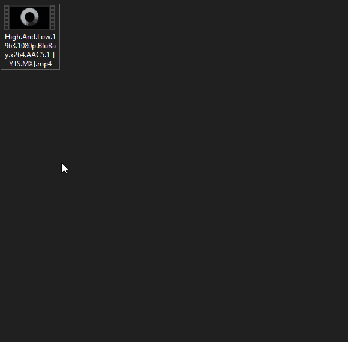

# Subtitles Downloader

An automated subtitle downloader for movies and TV shows that integrates with Windows context menu. This application allows you to download the best matching subtitles from OpenSubtitles.com with just a right-click on your video files.

## Requirements
- .NET Framework 4.8 or higher
- OpenSubtitles.com account

## Installation/Setup

1. Download the latest .exe from [releases page](https://github.com/Gabriel-sy/SubtitlesDownloader/releases)
2. Execute the .exe and install the program
3. When finished, click the desktop shorcut that was created
4. Enter your OpenSubtitles.com credentials, select the language and click the login button, after logging in, it will be ready to use

## How to Use

1. Right-click a video file
2. Look for "Download Subtitles" in the context menu
3. Click the option and wait for the download to complete
4. The subtitle file will be saved in the same directory as your video file

## Common issue
 - When logging in you might get message saying the API is limited. It's Opensubtitles.com limiting the api requests and it fixes itself by just waiting some time without trying again.

## Notes
 - Opensubtitles limits daily downloads for free users, so you might face errors downloading many in one day
 - This application only stores your login credentials locally. Your credentials are used solely for authenticating with OpenSubtitles.com
